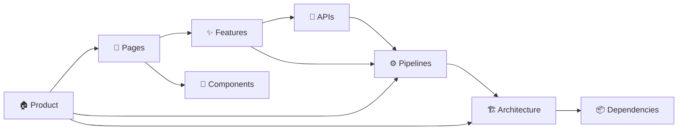

# 🗺️ MOC — Anuwad Project

> Map of Content for the entire Anuwad project. Every node links to a deeper MOC or individual note.

---

## Product & Vision

- [[What is Anuwad]] — Product definition and value proposition
- [[Why Anuwad Exists]] — Problem space and vision
- [[Design System]] — Deep Ocean theme, typography, color tokens
- [[Tech Stack]] — Frameworks, libraries, and architecture

---

## User Experience

- [[MOC — User Flows]] — How users accomplish tasks
- [[MOC — Pages]] — The application screens
- [[MOC — Features]] — Individual features and capabilities
- [[MOC — Components]] — Reusable UI building blocks

---

## Technical Architecture

- [[Architecture]] — System architecture and module dependency graph
- [[Folder Structure]] — Annotated map of the repository
- [[Dependencies]] — Every package dependency, grouped by concern
- [[Development Guidelines]] — Local setup, scripts, and coding conventions
- [[MOC — Pipelines]] — PDF Extraction → Translation → TTS
- [[MOC — APIs]] — External and browser API integrations
- [[End-to-End Pipeline]] — Complete data flow diagram
- [[Voice Cache Layer]] — Dual-storage neural voice model caching
- [[Memory & Storage Audit]] — Audit of large-data storage hotspots and memory optimizations

---

## Reference

- [[Glossary]] — Key terms and abbreviations
- [[Read Aloud Analysis]] — Read Aloud extension architecture & integration strategy

---

## Relationship Map

---
