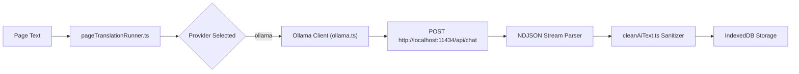

# Ollama API

> Local LLM inference integration enabling 100% private, offline document translation and explanation.
> **Source:** `src/lib/ollama.ts`, `src/components/settings/OllamaStatusSection.tsx`

---

## Capabilities

- **Local Inference:** Connects directly to local Ollama instances (default: `http://localhost:11434`).
- **Model Discovery:** Dynamically retrieves installed models via `/api/tags`.
- **Streaming Completions:** Consumes live NDJSON streams from `/api/chat` and `/api/generate`.
- **Zero Cloud Leakage:** Prompts, documents, and API keys never leave the user's local machine.

---

## Technical Architecture

---

## Key Endpoints

| Endpoint | Method | Purpose |
| :--- | :--- | :--- |
| `/api/tags` | `GET` | Lists all installed models and their parameter sizes |
| `/api/chat` | `POST` | Executes streaming multi-turn prompt completions |
| `/api/generate` | `POST` | Fallback single-prompt completion endpoint |

---

## Configuration & Fallbacks

- **Context Window:** Configurable `num_ctx` (defaults to 4096 tokens for fast local throughput).
- **CORS Requirements:** Ollama must allow browser origins (e.g. `OLLAMA_ORIGINS="*"`).
- **Status Indicator:** Settings page pings `/api/tags` to show real-time connection status (`connected` / `disconnected`).

---

## Relationships

- **Consumer:** [[Translation Pipeline]], [[AI Translation]], [[PageWorkstation]].
- **Alternative Providers:** [[OpenRouter API]].

---

_Part of [[MOC — APIs]]_
