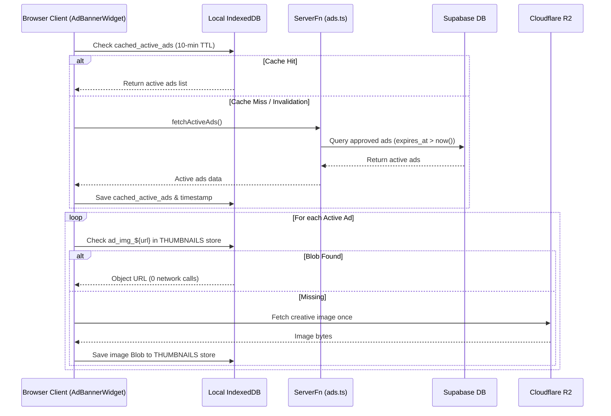

# Advertising & Sponsorship Dock Feature

> A non-intrusive, performance-optimized bottom dock for community sponsors and product showcases, backed by Razorpay, Supabase, and Cloudflare R2.
> **Source:** `src/lib/ads.ts`, `src/components/AdBannerWidget.tsx`, `src/components/AdSubmissionModal.tsx`, `src/routes/admin.tsx`

---

## Capabilities

- **3 Fixed Duration Sponsorship Slots:**
  - `slot-24h`: 24 Hours Spotlight (₹11) — Flash placement for launches and quick updates.
  - `slot-7d`: 7 Days Showcase (₹5,000) — Persistent 7-day featured placement.
  - `slot-30d`: 30 Days Sponsorship (₹16,000) — Monthly continuous showcase.
- **Client-Side IndexedDB Caching:**
  - Active ads are cached locally in IndexedDB (`META` store under `cached_active_ads`) with a 10-minute TTL, eliminating continuous polling.
  - Ad banner images are fetched once and saved as Blobs directly in IndexedDB (`THUMBNAILS` store under `ad_img_${src}`) so subsequent renders never hit Cloudflare R2.
- **Event-Driven Cache Invalidation:** Real-time updates occur via the custom event `anuwad:ads-changed` when an ad is approved, rejected, or deleted in the admin dashboard.
- **Razorpay Payment Integration:** Self-serve payment checkout modal (`createAdPaymentOrder` and `verifyAdPayment`) before ad submission.
- **Waitlist Support:** If a sponsorship tier is occupied, users can join a waitlist for notification when the slot frees up.
- **Admin Review Pipeline:** Admins can view pending submissions, approve ads (setting `approved_at` and `expires_at`), reject, or delete campaigns.

---

## Architecture & Data Flow

---

## Technical Mapping

- **`src/lib/ads.ts`** — Types (`AdRecord`, `AdPackage`), packages, `getCachedActiveAds()`, `invalidateAdsCache()`, `fetchActiveAds()`, `uploadAdCreative()`, `submitPendingAd()`, `createAdPaymentOrder()`, `verifyAdPayment()`, `adminListAllAds()`, `adminApproveAd()`, `adminRejectAd()`, and `adminDeleteAd()`.
- **`src/components/AdBannerWidget.tsx`** — Bottom dock UI with `AdBannerImage` local Blob caching, slot availability computation, and dismissible dock state.
- **`src/components/AdSubmissionModal.tsx`** — Advertiser booking modal with image crop/preview, Razorpay SDK checkout, and waitlist registration.
- **`src/routes/admin.tsx`** — Admin advertising tab with financial metrics, active/pending/expired statuses, approval actions, and event dispatch.

---

_Part of [[MOC — Features]]_
