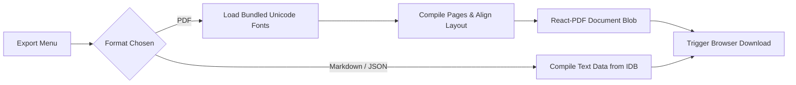

# Export System Feature

> Handles multi-format data extraction, document compilation, and print-ready multi-script PDF rendering.
> **Source:** `src/lib/export.ts`, `src/lib/pdfExport.tsx`, `src/components/ExportMenu.tsx`

---

## Capabilities

- **Print-Ready PDF (.pdf):**
  - High-fidelity bilingual and translated document generation via `@react-pdf/renderer`.
  - Embedded TrueType Unicode font families (`public/fonts/`) ensuring native glyph rendering without "tofu" boxes for Devanagari, Bengali, Tamil, Telugu, Malayalam, Gujarati, Gurmukhi, Odia, and Arabic.
  - Multi-page pagination math, header/footer document metadata, and auto-wrapped column coordinate layouts.
- **Markdown (.md):** Clean text files listing page numbers, original text, and AI translation results.
- **JSON (.json):** Detailed structured payloads containing translation settings, token counts, and full page data.

---

## Workflow Details

1. Users click the Export dropdown in the [[RightPanel]] or Mobile Reader sheet.
2. The export utility retrieves all document pages and AI results from [[IndexedDB Storage]].
3. For PDF exports, the engine inspects `doc.selectedLanguage`, loads the required `.ttf` font from `/fonts/`, and constructs a structured document layout.
4. Generates a temporary object URL and initiates the browser download.

---

## Relationships

- **Components:** [[RightPanel]], `ExportMenu.tsx`, `MobileOverflowSheet.tsx`.
- **Engine:** `@react-pdf/renderer`.
- **Fonts:** 14 bundled TrueType fonts in `public/fonts/`.

---

_Part of [[MOC — Features]]_
