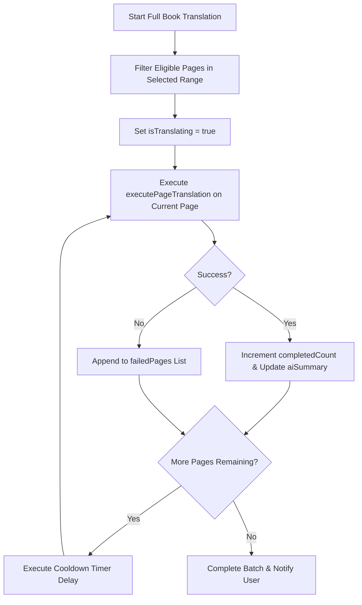

# Full Book Translation Feature

> Automated sequential chapter and full-book translation engine with rate-limit cooldown controls and floating progress telemetry.
> **Source:** `src/hooks/useFullBookTranslation.ts`, `src/components/FullBookTranslationModal.tsx`

---

## Capabilities

- **Sequential Processing:** Iterates through document pages sequentially in the background, feeding each page into the global translation runner.
- **Page Range Targeting:** Enables translating specific page ranges (e.g. Chapter 2: Pages 25–48) or entire books.
- **Rate-Limit Cooldown Control:** Configurable timer (0–10s) between page requests to prevent HTTP 429 rate-limiting from LLM providers.
- **Interactive Controls:** Supports Pause, Resume, and Cancel at any point during execution.
- **Persistent Floating Progress Dock:** When the modal is dismissed, a compact floating progress bar shows current page progress, completion count, and ETA countdown.
- **Automatic Retry Queue:** Identifies failed or errored pages during execution and offers a 1-click batch retry.

---

## Execution Flow

---

## Relationships

- **Engine:** [[Translation Pipeline]], `pageTranslationRunner.ts`.
- **UI Components:** `FullBookTranslationModal.tsx`, `FullBookTranslationDock.tsx`.
- **Storage:** [[IndexedDB Storage]].

---

_Part of [[MOC — Features]]_
