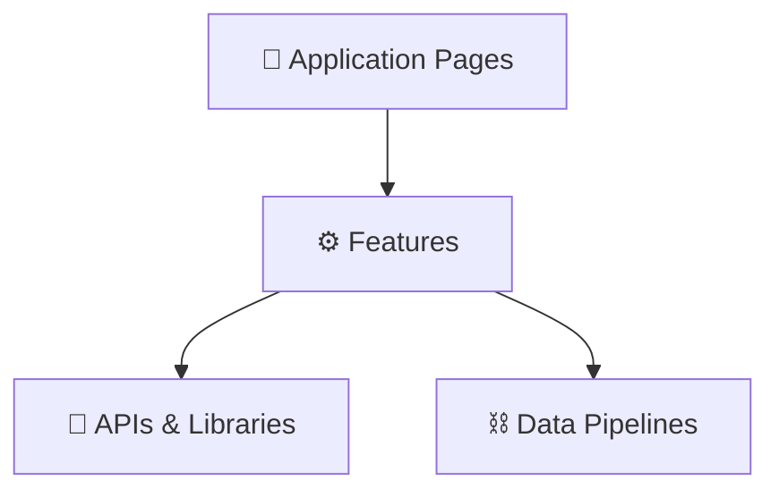

# ⚙️ MOC — Features

> The core functional capabilities of the Anuwad application.

---

## Features Directory

### Reading & Ingestion

- [[PDF Viewer]] — Lazy-rendering PDF view engine, canvas rendering, memory virtualization, and hook lifecycle safety.
- [[Document Management]] — Upload, metadata processing, thumbnails, storage, delete confirmation.
- [[Global Library]] — Shared R2-backed document vault with batch downloads and real-time local sync status.
- [[Text Selection Toolbar]] — Floating contextual menu providing Copy, Translate, and Speak actions.

### AI Processing

- [[AI Translation]] — Multi-provider processing (OpenRouter, OmniRouter, Ollama) with Translation and Explanation styles.
- [[Full Book Translation]] — Automated sequential chapter and full-book batch translation with rate-limit cooldown timers.
- [[Prompt Engineering & Explanation Tones]] — Consolidated 5+2 style architecture, FORMAT_RULES, EXPLAIN_RULES, prompt pipeline, and legacy style mapping.
- [[AI Response Sanitization]] — Post-processing sanitizer (`cleanAiText`) stripping markdown artifacts before DB storage and TTS.
- [[Auto-Translate|Continuous Auto-Read]] — Translate-ahead + auto-advance while listening to a page.
- [[Per-Page Overrides]] — Custom configurations (provider, model, tone, temperature, custom prompt payload editor) per page.
- [[API Key Management]] — Server key environment checks, client status badges, verification modal.

### Speech Synthesis

- [[Text-to-Speech]] — Dynamic TTS orchestration, lookahead sentence splitting, voice preferences.
- [[Piper Neural TTS]] — Local WASM-based neural engine, dual-storage voice caching, pre-flight voice onboarding gate.

### Export & Monetization

- [[Export System]] — Document and translation data exporter supporting Print-Ready Unicode PDFs (with bundled TrueType fonts), Markdown, and JSON.
- [[Advertising & Sponsorship]] — Self-serve sponsored slots, local IndexedDB creative caching, and admin approval pipeline.
- [[Authentication]] — Google Sign-In (Firebase Auth) and Firestore-backed reviews.

### Architecture & Audits

- [[Changelog & Architecture Decisions]] — Comprehensive Problem → Reason → Decision → Implementation → Outcome changelog.
- [[Memory & Storage Audit]] — Comprehensive audit of memory hotspots and optimization strategies.

---

## Technical Mapping

```mermaid
graph TD
    Pages[📄 Application Pages] --> Features[⚙️ Features]
    Features --> APIs[🔌 APIs & Libraries]
    Features --> Pipelines[⛓️ Data Pipelines]
```

---

_Part of [[00 — MOC — Project]]_
