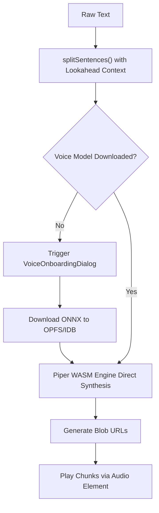

# Piper Neural TTS Feature

> WebAssembly-based offline neural speech synthesis system with on-demand voice model onboarding.
> **Source:** `src/context/TtsContext.tsx`, `src/components/VoiceOnboardingDialog.tsx`, `src/lib/tts.ts`

---

## Capabilities

- Performs neural speech synthesis locally in the browser using WebAssembly and ONNX Runtime.
- Works 100% offline once voice models are installed.
- Offers a catalog of different voice qualities (medium, high, low) across 90+ languages.
- Language-based voice filtering — the catalog displays voices matching the current output language.
- **Pre-Flight Voice Readiness Onboarding:** If playback is triggered for a language whose neural voice model is not yet cached, `TtsPlayer` intercepts the event, prompts the interactive `VoiceOnboardingDialog`, and seamlessly starts playback upon model download completion.

---

## Installation & Caching

1. The **Natural Voice Cache Manager** on the [[General Settings Page]] or the on-demand **Voice Onboarding Dialog** shows available voices for the current language.
2. Installing a voice downloads its ONNX model file (~20–60 MB) via the [[Voice Cache Layer]].
3. The cache layer uses a **dual-storage strategy**: OPFS (primary) with IndexedDB fallback, ensuring models persist across sessions.
4. A transparent `fetch` interceptor ensures that the Piper engine loads cached models automatically without any code changes to the engine itself.
5. On playback, the system uses `onnxruntime-web` with a single WASM thread (`numThreads = 1`) to reduce memory usage.

---

## Synthesis Pipeline

1. Text is segmented using intelligent lookahead regex in `splitSentences()` (`src/lib/tts.ts`) respecting abbreviations, decimals, and Indic punctuation (`।`).
2. Each chunk is synthesized directly by the WASM engine.
3. Raw audio data is converted to Blob URLs for playback via standard browser `<audio>` elements.
4. A synchronization safeguard (`lastVoiceUriRef`) prevents redundant model downloads and mid-playback restarts when the user switches voices rapidly.

---

## Relationships

- **Feature parent:** [[Text-to-Speech]].
- **API integration:** [[Piper WASM Engine]], [[Voice Cache Layer]].
- **Management UI:** [[General Settings Page]], `VoiceOnboardingDialog.tsx`.

---

_Part of [[MOC — Features]]_
