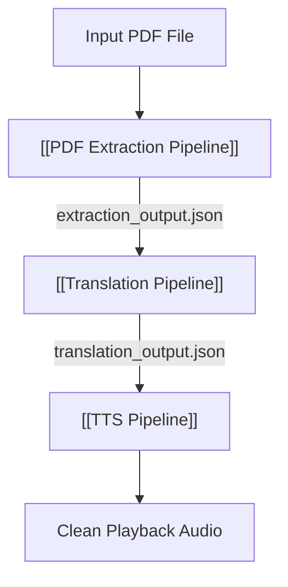

# ⛓️ MOC — Pipelines

> The three core processing pipelines that handle document digestion, translation, and speech generation in Anuwad.

---

## Processing Pipelines

| Pipeline                    | Input                      | Hand-off Format                       | Consumer                 |
| --------------------------- | -------------------------- | ------------------------------------- | ------------------------ |
| [[PDF Extraction Pipeline]] | PDF binary (`ArrayBuffer`) | `PageData` record (`text`, `columns`) | [[Translation Pipeline]] |
| [[Translation Pipeline]]    | `PageData` record          | `PageAi` record (`result`, `status`)  | [[TTS Pipeline]]         |
| [[TTS Pipeline]]            | `PageAi.result` text       | Synthesized audio chunks              | Browser Player           |

---

## Data Flow Diagram

---

## Related MOCs

- [[MOC — User Flows]] — The user-facing experience of these pipelines
- [[Architecture]] — How these pipelines fit into the overall module graph

---

_Part of [[00 — MOC — Project]]_
