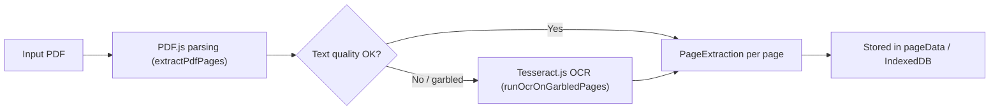

# PDF Extraction Pipeline

> The first stage of the document processing pipeline. Extracts text content from PDF binaries and structures it for translation.
> **Source:** `src/lib/pdf.ts`

---

## Pipeline Stages

---

## Detailed Steps

### 1. Document Load

- `loadDocFromSource()` / `loadPdfDocument()` load the PDF via a lazily-imported `pdfjs-dist` (`getPdfjs()`), with the worker script served locally.

### 2. Layout & Text Extraction

- `extractPdfPages()` walks each page's `TextContent` from PDF.js and runs `sortByColumns()` (column-aware geometry: `detectColumns` → `groupIntoSegments` → `sortByColumns`) so multi-column layouts read in the correct order instead of raw left-to-right stream order.
- `cleanExtractedText()` strips Private Use Area glyphs, garbage/symbol-font characters, and other pdf.js extraction artifacts.

### 3. OCR Fallback for Garbled/Scanned Pages

- `checkTextQuality()` scores extracted text (via `isGarbageLine()` heuristics) to detect pages that are image-only or where the embedded text layer is corrupted/garbled.
- `runOcrOnGarbledPages()` renders flagged pages to a canvas and runs them through **Tesseract.js only** (`ocrPdfPage()` / `ocrPageById()`) — no external OCR service (e.g. Google Vision, AWS Textract) is used; everything runs client-side.
- `cleanOcrText()` applies OCR-specific text cleanup to the Tesseract output.

---

## Output

Each page produces a `PageExtraction` (`text`, layout metadata) which is written to the `pageData` IndexedDB store (see [[IndexedDB Storage]]) and consumed by the [[Translation Pipeline]].

---

## Relationships

- **Core Technology:** [[PDF.js]], Tesseract.js.

---

_Part of [[MOC — Pipelines]]_
