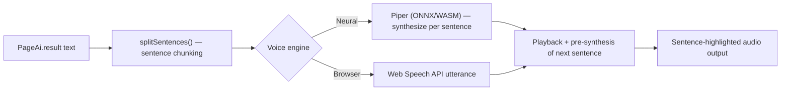

# TTS Pipeline

> The final stage of the document processing pipeline. Synthesizes translated/explained text into spoken audio, sentence by sentence.
> **Source:** `src/lib/tts.ts`, `src/context/TtsContext.tsx`

---

## Pipeline Stages

---

## Detailed Steps

### 1. Sentence Chunking

- `splitSentences()` / `splitLineByPunctuation()` (`src/lib/tts.ts`) split the AI result text into sentence-level chunks using punctuation rules (commas are intentionally excluded so an engine reads them as a natural micro-pause instead of a hard break). There is no SSML generation — text is passed as plain strings to either engine.

### 2. Voice Synthesis

`speakSentence()` in `TtsContext` (`src/context/TtsContext.tsx`) drives one of two engines per the user's selected voice:

- **Neural (Piper):** `@diffusionstudio/vits-web` runs inference through `onnxruntime-web` (ONNX/WASM), producing a playable audio buffer per sentence. Voice model files are served from the [[Voice Cache Layer]] (OPFS/IndexedDB).
- **Browser (native):** the [[Web Speech API]]'s `SpeechSynthesisUtterance` is used directly as a fallback/alternative, with no local model download required.

### 3. Pre-Synthesis Pipelining

- While one sentence plays, `preSynthesizeNext()` compiles the _next_ sentence's neural audio in the background so playback advances without an audible gap between sentences.

### 4. Playback & Highlighting

- Sentence boundaries drive [[HighlightableText]], which highlights the sentence currently being spoken in sync with playback position.
- If **Continuous Play** is enabled and the last sentence on a page finishes, a `doclens:tts-next-page` event triggers auto-advance to the next page (see [[Auto-Translate|Continuous Auto-Read]]).

---

## Relationships

- **Core Technologies:** [[Piper WASM Engine]], [[Web Speech API]].
- **Consumer of:** [[Translation Pipeline]] output (`PageAi.result`).

---

_Part of [[MOC — Pipelines]]_
