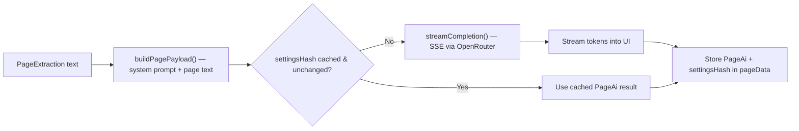

# Translation Pipeline

> The second stage of the document processing pipeline. Translates or explains extracted page text via an LLM.
> **Source:** `src/lib/openrouter.ts`, `src/components/PageWorkstation.tsx`

---

## Pipeline Stages

---

## Detailed Steps

### 1. Payload Construction

- `buildPagePayload()` (`src/lib/openrouter.ts`) assembles the request: mode-specific system instructions (`MODE_INSTRUCTIONS` — `translate` or `explain`), an explanation style (`EXPLANATION_STYLES`, only used in `explain` mode), target language, temperature, and the extracted page text.
- There is no separate NLP sentence-segmentation step here — the whole page's extracted text is sent as one payload; sentence-level splitting happens later, at TTS playback time (see [[TTS Pipeline]]).

### 2. Cache Check via Settings Hash

- `PageWorkstation.tsx` computes a `computeSettingsHash({ modelId, mode, language, style, temperature })` (`src/lib/storage.ts`) and compares it against the page's stored hash. If unchanged, the existing cached `PageAi.result` is reused instead of re-calling the LLM.

### 3. Streaming Completion

- On a cache miss, `streamCompletion()` calls `completeWithServerOpenRouter()` — a TanStack Start server function that proxies OpenRouter's chat-completions endpoint as a live Server-Sent Events (SSE) stream, so the API key is never exposed to the client.
- Tokens are parsed from `data:` lines and appended to the UI incrementally as they arrive, with retry/backoff on transient failures.

### 4. Result Storage

- The completed result, its `AiMode`/`AiStatus`, and the settings hash used to produce it are written to the page's `PageAi` record in the `pageData` IndexedDB store (see [[IndexedDB Storage]]).

There is no glossary/terminology-matching step and no automated translation-quality scoring (e.g. BLEU/COMET) in the current pipeline — result quality depends entirely on the selected LLM.

---

## Relationships

- **Core Technology:** [[OpenRouter API]].
- **Consumer:** [[TTS Pipeline]] reads the stored `PageAi.result` text.

---

_Part of [[MOC — Pipelines]]_
