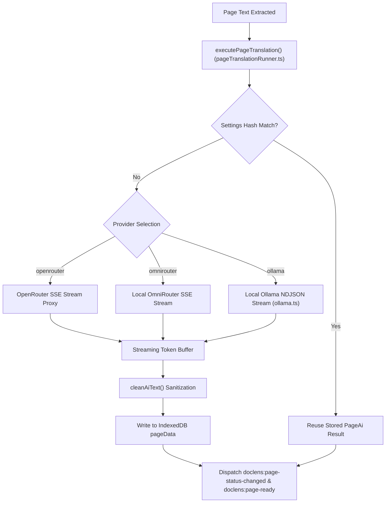

# Translation Pipeline

> The second stage of the document processing pipeline. Translates or explains extracted page text via Cloud or Local LLMs.
> **Source:** `src/lib/pageTranslationRunner.ts`, `src/lib/openrouter.ts`, `src/lib/ollama.ts`, `src/components/PageWorkstation.tsx`

---

## Pipeline Stages

```mermaid
flowchart TD
    A[Page Text Extracted] --> B["executePageTranslation() (pageTranslationRunner.ts)"]
    B --> C{Settings Hash Match?}
    C -->|Yes| D[Reuse Stored PageAi Result]
    C -->|No| E{Provider Selection}
    E -->|openrouter| F["OpenRouter SSE Stream Proxy"]
    E -->|omnirouter| G["Local OmniRouter SSE Stream"]
    E -->|ollama| H["Local Ollama NDJSON Stream (ollama.ts)"]
    F --> I[Streaming Token Buffer]
    G --> I
    H --> I
    I --> J["cleanAiText() Sanitization"]
    J --> K["Write to IndexedDB pageData"]
    K --> L["Dispatch doclens:page-status-changed & doclens:page-ready"]
    D --> L
```

---

## Detailed Steps

### 1. Detached Background Execution
- Translation execution is managed by a singleton module ([`src/lib/pageTranslationRunner.ts`](file:///home/sanskar/Desktop/doclens-ai/src/lib/pageTranslationRunner.ts)) that runs independently of React component lifecycles.
- When users navigate across pages or switch tabs ("Original Text" vs "AI Assistant"), in-flight translations continue seamlessly in the background without being aborted.

### 2. Multi-Provider Resolution
- Supports three AI providers:
  1. **OpenRouter:** Cloud inference via live Server-Sent Events (SSE).
  2. **OmniRouter:** Local inference via local OpenAI-compatible endpoints.
  3. **Ollama:** Direct local inference via native [[Ollama API]] (`/api/chat`).

### 3. Payload Construction & Cache Check
- `buildPagePayload()` (`src/lib/openrouter.ts`) constructs mode instructions (`translate` or `explain`), style profiles, target languages, and temperature settings.
- Computes `computeSettingsHash()` against stored IndexedDB data; reuses cached results when settings are identical.

### 4. Post-Processing & Event Dispatch
- Incoming stream chunks pass through `cleanAiText()` to strip markdown formatting and code blocks for smooth TTS compatibility.
- Once completed, writes result to `pageData` in [[IndexedDB Storage]] and emits `doclens:page-ready` and `doclens:page-status-changed` events across the UI.

### 5. Non-Destructive Union Sync
- Syncing with Supabase utilizes a union merge strategy in [`src/lib/sync.ts`](file:///home/sanskar/Desktop/doclens-ai/src/lib/sync.ts) that merges remote pages with local records without overwriting local custom translations.

---

## Relationships

- **Providers:** [[OpenRouter API]], [[Ollama API]].
- **Consumer:** [[TTS Pipeline]] reads the stored clean `PageAi.result` text.
- **Batch Processing:** [[Full Book Translation]] sequentially coordinates this pipeline across page ranges.

---

_Part of [[MOC — Pipelines]]_
