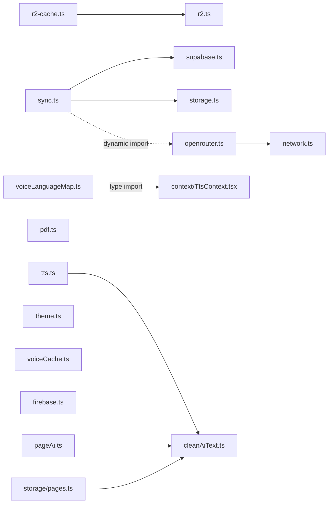

# Architecture

> System architecture and module dependency graph for Anuwad.

---

## System Overview

Anuwad is a **client-heavy single-page application**. Nearly all document processing — PDF rendering, text extraction, OCR, and neural TTS synthesis — runs entirely in the browser. The server side is a thin layer of **TanStack Start server functions** (`createServerFn`), used only where a task genuinely can't or shouldn't happen client-side: keeping the OpenRouter API key secret, and (optionally) talking to Cloudflare R2 / Supabase for the shared Global Library feature.

```
Browser (Client)
├── React 19 SPA (TanStack Router, Vite 7)
│   ├── PDF.js + tesseract.js ──── PDF rendering, text extraction, OCR fallback
│   ├── Piper (vits-web) + onnxruntime-web ── neural TTS, WASM
│   ├── Firebase Auth SDK ──────── Google Sign-In (optional)
│   ├── IndexedDB (idb) ────────── documents, page text/AI results, thumbnails
│   ├── OPFS / IndexedDB ───────── neural voice model cache
│   └── localStorage ───────────── user preferences (AI defaults, TTS settings)
│
└── Server Functions (TanStack Start `createServerFn`, deployed on Vercel/Nitro)
    ├── OpenRouter proxy ──────── SSE-streamed chat completions; API key stays server-side
    ├── Cloudflare R2 ──────────── upload/list/delete for the Global Library vault (opt-in)
    └── Supabase ───────────────── shared extraction/translation cache (opt-in)
```

---

## Module Dependency Graph (`src/lib/*`)



- **`network.ts`** is the one shared leaf module — it turns offline/fetch failures into a friendly message, and `openrouter.ts` depends on it.
- **`r2-cache.ts`** wraps `r2.ts`'s `listR2Files()` with a 10-minute in-memory TTL cache.
- **`sync.ts`** is the integration point between the local IndexedDB layer (`storage.ts`) and the shared Supabase cache (`supabase.ts`); it also dynamically imports `openrouter.ts` for one read-model-list use.
- **`cleanAiText.ts`** is the AI response sanitization module — consumed by `pageAi.ts` (re-export), `storage/pages.ts` (sanitize before IDB write), and `tts.ts` (sanitize before sentence splitting). Introduced to strip markdown artifacts that LLMs sometimes emit despite system prompt rules.
- **`voiceLanguageMap.ts`** imports the `TtsVoice` type from `context/TtsContext.tsx` — a lib module depending on a context type, a minor layering inversion but not a cycle.
- Everything else (`pdf.ts`, `theme.ts`, `voiceCache.ts`, `firebase.ts`, `utils.ts`, `models.ts`) is a leaf with no dependency on other `lib/*` modules.

There is no shared "env/config" module — the `ENABLE_GLOBAL_SYNC` feature-flag check is currently duplicated independently in `r2.ts`, `supabase.ts`, and `sync.ts`.

---

## State Ownership

| Layer | Owns | Where |
| ------ | ------ | ------- |
| `AuthContext` | Firebase user session | `src/context/AuthContext.tsx` |
| `TtsContext` | TTS playback state machine (native + neural), voice catalog, continuous-play | `src/context/TtsContext.tsx` |
| `storage.ts` (IndexedDB) | Documents, per-page text + AI results, thumbnails | `src/lib/storage.ts` |
| `localStorage` | AI defaults (model/mode/style/temperature/language), TTS preferences | scattered per-module getters/setters in `openrouter.ts`, `theme.ts`, `TtsContext.tsx` |
| URL query params | Active page number (`?page=N`) | `src/routes/doc.$id.tsx` |

---

## Cross-Component Event Bus

Several components that don't have a direct parent/child or context relationship coordinate via typed-by-convention (but currently untyped) `CustomEvent`s dispatched on `window`:

| Event | Dispatched by | Listened by | Purpose |
| ------ | --------------- | ------------- | --------- |
| `doclens:page-ready` | `PageWorkstation.tsx` | `RightPanel.tsx` | A page's AI result finished generating |
| `doclens:ensure-page-ready` | `RightPanel.tsx` | `PageWorkstation.tsx` | Request translation for a page (current or look-ahead) |
| `doclens:translate-selection` | `PdfViewer.tsx` | `PageWorkstation.tsx` | User selected text and chose "Translate" |
| `doclens:scroll-to-pdf` / `doclens:scroll-to-workstation` | `RightPanel.tsx` / `PageWorkstation.tsx` | `PdfViewer.tsx` / `RightPanel.tsx` | Sync scroll position between the PDF pane and the AI panel |
| `doclens:tts-next-page` | `TtsContext.tsx` | `RightPanel.tsx` | Continuous-play auto-advance to the next page |

See [[End-to-End Pipeline]] for how these events chain together across a full read.

---

## Related

- [[Tech Stack]] — Frameworks and libraries in more depth.
- [[Folder Structure]] — Annotated repository layout.
- [[Dependencies]] — Every package dependency, grouped by concern.
- [[End-to-End Pipeline]] — Full PDF → Translation → TTS data flow.
- [[MOC — Pipelines]] — The three processing pipelines.

---

_Part of [[MOC — Product]]_
